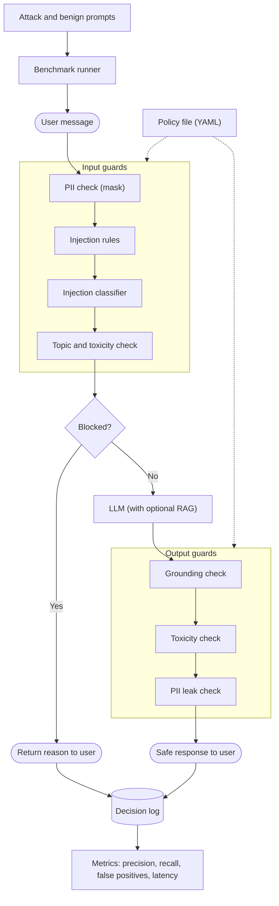

# LLM Guardrails

A modular guardrails pipeline for LLM apps, with a benchmark to measure how well it works.

```mermaid
flowchart TD
    A([User message]) --> B

    subgraph IN [Input guards]
        B["PII check (mask)"] --> C["Injection rules"]
        C --> D["Injection classifier"]
        D --> E["Topic and toxicity check"]
    end

    E --> F{Blocked?}
    F -- Yes --> G([Return reason to user])
    F -- No --> H["LLM (with optional RAG)"]

    H --> I

    subgraph OUT [Output guards]
        I["Grounding check"] --> J["Toxicity check"]
        J --> K["PII leak check"]
    end

    K --> L([Safe response to user])

    G --> M[(Decision log)]
    L --> M

    N["Policy file (YAML)"] -.-> IN
    N -.-> OUT

    O["Attack and benign prompts"] --> P["Benchmark runner"]
    P --> A
    M --> Q["Metrics: precision, recall, false positives, latency"]
```